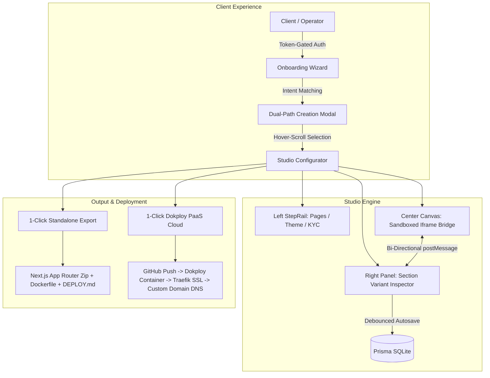

<div align="center">

# 🌐 SiteForge (Airwallex Site Cloner)
### Compliance-Ready Business Website Generator & Studio Engine

[](https://nextjs.org/)
[](https://www.typescriptlang.org/)
[](https://tailwindcss.com/)
[](https://dokploy.com/)
[](LICENSE)

<p align="center">
  A high-performance visual website configurator, client onboarding portal, and operator studio.<br/>
  Generate and deploy bespoke, multi-page, statutory compliance-ready business & e-commerce websites in seconds.
</p>

[Key Features](#-key-features) • [Architecture](#-architecture) • [Template Catalog](#-turnkey-template-library) • [Quick Start](#-quick-start) • [Deployment](#-deployment--custom-domains) • [Contributing](#-contributing)

</div>

---

## ⚡ Overview

**SiteForge** transforms website generation from generic cookie-cutter wireframes into rich, authentic, agency-grade commercial websites. Tailored for business operators, agencies, and invited clients, the platform generates production-ready Next.js web applications with statutory merchant compliance (KYC entity registration, jurisdiction-specific policy pages, legal footer bars) embedded automatically.

Every generated website can be:
1. **Exported in 1 Click**: Download a complete, standalone Next.js App Router source `.zip` with bundled `Dockerfile` and multi-platform `DEPLOY.md` guides.
2. **Deployed in 1 Click to Cloud PaaS**: Push automatically to private GitHub repositories, provision on Dokploy containers, and map custom domains with automated Traefik Let's Encrypt SSL.

---

## ✨ Key Features

```
┌────────────────────────────────────────────────────────────────────────┐
│                        CORE CAPABILITY MATRIX                          │
├──────────────────────┬──────────────────────┬──────────────────────────┤
│ 🎨 Porto-Grade Engine │ 🛒 Dynamic E-Commerce│ 🖼️ Semantic Asset Vault │
│ Multi-Layout Section │ Slide-Over Cart with │ 80+ Pre-Curated High-Res │
│ Variants & Top-Bars  │ Free Shipping Meter  │ Industry Photo Bindings  │
├──────────────────────┼──────────────────────┼──────────────────────────┤
│ 👁️ Hover-Scroll Cards │ ⚡ Bi-Directional    │ 🚀 1-Click Multi-Deploy  │
│ 47 Full-Page Desktop │ Instant <5ms Live    │ Standalone .zip Export & │
│ Screenshots Captured │ PostMessage Sync     │ Dokploy Custom Domain DNS│
└──────────────────────┴──────────────────────┴──────────────────────────┘
```

### 1. 🧩 Multi-Layout Section Engine
Never suffer from "same-y" templates. Every section component supports multiple distinct DOM architectures:
- **Headers**: `corporate_utility` (top info bar with phone/hours/jurisdiction flag + mega-nav), `floating_glass_pill` (pinned backdrop-blur island), `editorial_centered`, and `default`.
- **Heroes**: `lead_form` (embedded interactive consultation/quote card), `asymmetric_bento_collage` (3-frame collage with floating metric glass pills), `fullbleed_display` (72px editorial display headline with luxury CTA), `stats_banner_split`, and `default`.
- **Feature Grids**: `asymmetric_bento` (2x2 featured box + stacked cards), `sticky_scroll` (pinned left narrative + scrolling right cards), `tabbed_showcase` (interactive category tabs), and `zigzag_rows`.
- **Social Proof & Testimonials**: `infinite_marquee` (continuous dual-row CSS marquee ticker with edge fade masks), `editorial_pullquote` (prominent 32px italicized serif quote + founder avatar), and `rating_masonry` (Trustpilot/Google review summary + 3-column star review cards).
- **Pricing & Offerings**: `glow_card_deck` (radial glowing gradient border + annual/monthly toggle with discount badge), `comparison_table` (sticky feature matrix), and `custom_quote_service`.

### 2. 🛍️ E-Commerce & Retail Subsystem
- **Slide-Over Cart Drawer (`CartDrawer.tsx`)**: Dynamic free shipping progress bar, promo code validation (`AIRWALLEX15`, `SAVE15`), quantity increment/decrement, and merchant payment trust seals (Airwallex, Apple Pay, Visa, Mastercard, AMEX).
- **Interactive Product Cards**:
  - `fashion_minimal`: 4:5 portrait aspect ratio, hover secondary image flip, and interactive color swatch dots directly on the card switching preview photos.
  - `mega_catalog`: 1:1 square, discount percentage pill badge (`-30% OFF`), star reviews, and animated stock scarcity progress bar (`Only 3 left in stock!`).
  - `single_flagship_bundle`: Exploded technical specifications matrix and interactive bundle pack selector.
- **Client-Side Persistent Cart**: Lightweight Zustand v5 store with `localStorage` persistence and SSR hydration safety.

### 3. 🖼️ Semantically-Indexed Curated Asset Vault
- 80 high-resolution assets strictly categorized by **Domain** (E-Commerce, Corporate, Healthcare, Legal, Construction), **SubCategory** (`women_tops`, `men_footwear`, `watches`, `courtroom_legal`, `heavy_construction`), **Role** (hero banner, product thumbnail, team portrait), and **Aspect Ratio** (`1:1`, `4:5`, `16:9`, `3:2`).
- Image picker automatically locks aspect ratios and filters by contextual intent.

### 4. ⚖️ Merchant Underwriting & Statutory Compliance
- Automated generation of legal entity footers displaying registered company name, company number, and registered office address.
- Jurisdiction presets (United Kingdom, United States, Singapore, UAE, Hong Kong, European Union).
- Auto-generated legal policy pages (Terms of Service, Privacy Policy, Refund & Cancellation, Shipping & Delivery).

---

## 🏛️ Architecture



---

## 📚 Turnkey Template Library

The repository includes pre-built, production-ready flagship starter templates:

| Archetype | Flagship Template | Signature Sections & Layouts | Image Vault Binding |
|---|---|---|---|
| **Legal & Advisory** | *Blackwood & Stone Legal* | `corporate_utility` Nav, `lead_form` Hero, `sticky_scroll` Practice Areas, `editorial_pullquote` Testimonials | `legal > courtroom_legal`, `attorney_portrait` |
| **Luxury Fashion DTC** | *Aura Atelier Fashion* | `editorial_centered` Nav, `editorial_center` Hero, `fashion_minimal` 4:5 Swatches, `infinite_marquee` Proof | `ecommerce > women_tops`, `watches`, `bags` |
| **Heavy Construction** | *Vanguard Infrastructure* | `corporate_utility` Nav, `stats_banner_split` Hero, `asymmetric_bento` Projects, Quote Form | `construction > heavy_construction`, `civil` |
| **Modern Cloud SaaS** | *Apex Cloud Orchestration* | `floating_glass_pill` Nav, `asymmetric_bento_collage` Hero, `tabbed_showcase` Features, `glow_card_deck` Pricing | `corporate > office_coworking`, `executive` |
| **Mega Electronics** | *VoltTech Gear & Audio* | `corporate_utility` Nav, `lead_form` Promo Hero, `mega_catalog` Scarcity Bars, Instant Filter Tabs | `ecommerce > hardware`, `headphones`, `tech` |

---

## 🚀 Quick Start

### Prerequisites
- Node.js `20.x` or `22.x` (LTS recommended)
- npm or pnpm

### Installation

1. **Clone the repository**:
   ```bash
   git clone https://github.com/usmankhan4001/site-generator-app.git
   cd site-generator-app/builder-app
   ```

2. **Install dependencies**:
   ```bash
   npm install
   ```

3. **Configure Environment Variables**:
   ```bash
   cp .env.example .env
   ```
   Fill in your configuration:
   ```env
   DATABASE_URL="file:./dev.db"
   BETTER_AUTH_SECRET="your-secure-random-secret"
   BETTER_AUTH_URL="http://localhost:3000"
   SUPER_ADMIN_EMAIL="admin@yourdomain.com"
   ```

4. **Initialize Database & Seed Super Admin**:
   ```bash
   npx prisma migrate dev
   npm run seed:admin
   ```

5. **Start Development Server**:
   ```bash
   npm run dev
   ```
   Open [http://localhost:3000](http://localhost:3000) to access the studio.

---

## 🚢 Deployment & Custom Domains

### Standalone Export
Click **"Export Code (.zip)"** in the studio top bar. The generated archive contains:
- Full Next.js 16+ App Router code with Tailwind CSS v4.
- Production multi-stage `Dockerfile`.
- Comprehensive `DEPLOY.md` with zero-config guides for Vercel, Netlify, Cloudflare Pages, AWS, and DigitalOcean.

### Automated Dokploy Cloud PaaS
Set the following keys in `.env` to enable automated 1-click deployments:
```env
GITHUB_TOKEN=ghp_your_personal_access_token
GITHUB_USERNAME=your_github_username
DOKPLOY_HOST=https://paas.yourdomain.com
DOKPLOY_API_KEY=your_dokploy_api_key
```

### Custom Domain DNS Setup
When mapping a custom domain (e.g. `clientbrand.com` or `shop.clientbrand.com`):
- **Subdomain (`CNAME`)**: Point `shop` to `paas.yourdomain.com`.
- **Apex Domain (`A Record`)**: Point `@` to your Dokploy server public IPv4.
- SSL certificates are automatically provisioned via Traefik and Let's Encrypt.

---

## 📂 Project Structure

```
site-generator-app/
├── builder-app/                    # Primary Next.js Studio & Generator Webapp
│   ├── src/
│   │   ├── app/                    # Next.js App Router (Studio, Admin, Auth, APIs)
│   │   │   ├── admin/              # Multi-tenant admin & publish review queue
│   │   │   ├── api/                # Projects, Export, Deploy, Domain, Onboarding APIs
│   │   │   ├── onboarding/         # 4-Step client onboarding questionnaire
│   │   │   └── project/[id]/       # 3-Pane Studio Configurator workspace
│   │   ├── components/             # Reusable UI primitives & Studio panels
│   │   │   ├── commerce/           # CartDrawer, AddToCartButton, CartTrigger
│   │   │   ├── dashboard/          # ProjectCard, TemplatePreviewCard
│   │   │   └── studio/             # Workspace, PreviewPane, StepRail, SectionEditor
│   │   ├── lib/                    # Dokploy client, GitHub automation, Assembler, Vault
│   │   │   ├── assemble.ts         # Standalone Next.js codebase compiler
│   │   │   ├── dokploy.ts          # Dokploy PaaS API client & DNS verification
│   │   │   └── images/vault.ts     # 80-asset semantically-indexed photography vault
│   │   ├── site/                   # Site Kit — Single Source of Truth
│   │   │   ├── archetypes/         # Archetype blueprints & rich starter sets
│   │   │   ├── commerce/           # E-commerce store, formatting & cart state
│   │   │   ├── sections/           # Multi-layout section renderers (Header, Hero, etc.)
│   │   │   ├── schema.ts           # Unified SiteContent & Section discriminated union
│   │   │   └── themes.ts           # 21 OKLCH design themes & token presets
│   │   └── store/                  # Zustand studio state & auto-save engine
│   ├── public/
│   │   ├── previews/               # 47 full-page desktop screenshots for hover previews
│   │   └── section-thumbs/         # Visual thumbnail catalog for section inserter
│   └── scripts/                    # Playwright screenshot pipeline & seed utilities
├── template/                       # Standalone Next.js runtime shell for generated sites
└── .github/                        # GitHub Actions CI workflows & issue templates
```

---

## 🤝 Contributing

Contributions are welcome! Please see our [Contributing Guide](CONTRIBUTING.md) for instructions on adding new section layouts, themes, or industry archetypes.

---

## 📄 License

This project is licensed under the [MIT License](LICENSE).
