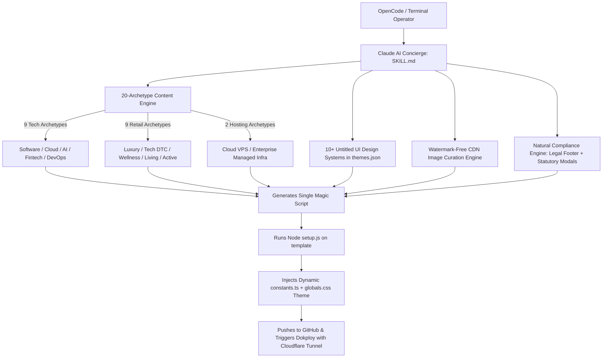

# Airwallex Site Cloner: Untitled UI & 20-Archetype System Overhaul

## Overview & Objectives
Transform the **Airwallex Site Cloner** package from a prototype into a high-converting, production-ready website generation engine. The overhaul addresses critical design flaws (killing the "fake compliance/AI-slop" feel), implements the world-class **Untitled UI** design language, introduces a rich database of **20 industry archetypes** across 3 sectors (9 Software/Tech, 9 E-Commerce, 2 Web Hosting), provides a **10+ color & design system matrix** (9x9 combinations for guaranteed uniqueness), integrates verified **watermark-free CDN imagery**, and establishes natural, professional **Airwallex KYC compliance** in footers and statutory legal pages.

---

## Identified Deficiencies in Current Implementation

1. **Obvious "Made-for-KYC" Visual Artifacts**:
   - `template/src/app/page.tsx` contains a prominent full-width `<section>` titled `"Business Information"` displaying legal company names, registration numbers, and governing law directly on the homepage. Legitimate operating companies never design their homepage this way.
2. **Hardcoded Monolithic Template**:
   - `page.tsx` contains 2,100+ lines with hardcoded `BUSINESS`, `SERVICES`, and `PRODUCTS` constants defined in-file, making `src/lib/constants.ts` ineffective and preventing dynamic archetype injection.
3. **Brittle String-Replacement Setup**:
   - `skill/scripts/setup.js` only executes five regex replacements on `src/lib/constants.ts` (which wasn't even imported by `page.tsx`), leaving all images, copy, and features stuck on the dummy "NexaSoft" content.
4. **Primitive Design System**:
   - `skill/resources/themes.json` only contains 3 basic color presets with no font pairings, surface scales, border radius rules, or modern Untitled UI tokens.
5. **Missing Strategic Image Pipeline**:
   - No curated image library or rules, resulting in barren UI blocks or broken placeholders.
6. **Deployment Inflexibility**:
   - No native support for **OpenCode**, and deployment was hardcoded without proper **Cloudflare Tunnel (cloudflared)** integration.

---

## Proposed Architecture & Component Design



---

## The 20 Industry Archetype Blueprint Database (9 - 9 - 2)

### Group 1: Software Development & Tech Consulting (9 Archetypes)
1. **Enterprise Cloud & DevOps Architecture**
   - *Key Focus*: Multi-cloud migrations (AWS/Azure/GCP), Kubernetes clustering, Terraform IaC, CI/CD pipeline automation, 99.99% enterprise SLA.
   - *Layout*: Architecture metric blocks, terminal/pipeline visualizer card, tier breakdown, consultation scope modal.
2. **Applied AI & Machine Learning Studio**
   - *Key Focus*: Custom LLM fine-tuning, computer vision models, retrieval-augmented generation (RAG), predictive analytics.
   - *Layout*: Neural graph/model latency metrics, interactive workflow cards, enterprise security badge.
3. **Fintech & Payment Systems Engineering**
   - *Key Focus*: Core ledger infrastructure, PCI-DSS Level 1 readiness, ISO 20022 messaging, real-time fraud mitigation engines.
   - *Layout*: Transaction throughput counters, security certification grid, high-ticket scope scheduler.
4. **SaaS Product Velocity Lab**
   - *Key Focus*: Rapid MVP development, Next.js/React full-stack builds, design-to-code sprints, product-market fit engineering.
   - *Layout*: Sprint velocity timeline, interactive interactive feature tabs, fixed-scope tier packages.
5. **Cybersecurity & Threat Defense**
   - *Key Focus*: Penetration testing, Zero-Trust network architecture, SOC2 Type II / ISO27001 compliance readiness, 24/7 SIEM monitoring.
   - *Layout*: Threat mitigation matrix, compliance checklist, immediate audit booking drawer.
6. **Full-Stack Agile Web & Mobile Development**
   - *Key Focus*: Cross-platform iOS/Android (React Native/Flutter), headless web apps, responsive design systems.
   - *Layout*: Device preview bento grid, technology stack chips, client case studies.
7. **Data Engineering & Real-Time Analytics**
   - *Key Focus*: Databricks/Snowflake data warehousing, Apache Kafka streaming, BI executive dashboards.
   - *Layout*: Data pipeline flow diagram, query performance stats, enterprise licensing tiers.
8. **Legacy Modernization & Digital Transformation**
   - *Key Focus*: Monolith-to-microservices migration, database refactoring, cloud-native modernization, zero-downtime cutovers.
   - *Layout*: Before/after modernization comparison matrix, risk mitigation milestones, enterprise advisory contact flow.
9. **IoT & Industrial Automation Systems**
   - *Key Focus*: Edge computing, MQTT telemetry, smart factory sensor integration, embedded hardware firmware.
   - *Layout*: Telemetry feed preview, hardware spec tables, B2B procurement consultation.

---

### Group 2: E-Commerce & Retail (9 Archetypes)
1. **Minimalist Luxury Fashion & Apparel**
   - *Key Focus*: Haute couture, sustainable cashmere/silk, seasonal editorial lookbooks, tailored fits.
   - *Layout*: Large editorial banner, lookbook gallery, fabric detail cards, interactive slide-out cart drawer.
2. **Smart Tech & Consumer Electronics**
   - *Key Focus*: ANC headphones, minimalist charging docks, ergonomic peripherals, aerospace-grade aluminum builds.
   - *Layout*: Dark mode spec breakdown, battery/chip callout cards, instant product checkout flow.
3. **Clean Botanical Wellness & Skincare**
   - *Key Focus*: Dermatologist-tested, organic botanical actives, vegan/cruelty-free, transparent ingredient sourcing.
   - *Layout*: Ingredient breakdown bento, routine step selector, subscription cadence discount toggle.
4. **Scandinavian Furniture & Interior Living**
   - *Key Focus*: Solid oak dining, modular seating, acoustic panels, timeless architectural minimalism.
   - *Layout*: Room lifestyle showcase, materials & dimensions guide, swatches preview.
5. **High-Performance Activewear & Athletics**
   - *Key Focus*: Seamless compression, moisture-wicking polymers, athletic training gear, Olympic-grade durability.
   - *Layout*: Action photography bento, size/fit guide modal, quick-add bundle selector.
6. **Artisan Gourmet Provisions & Specialty Coffee**
   - *Key Focus*: Single-origin micro-lots, farm-to-cup traceability, direct trade, craft roasting profiles.
   - *Layout*: Origin map & altitude cards, flavor notes selector, taster pack bundle builder.
7. **Sustainable Living & Eco-Essentials**
   - *Key Focus*: Zero-waste home goods, biodegradable packaging, plastic-free alternatives, 1% for the Planet.
   - *Layout*: Impact counter (kg plastic saved), transparency certification badges, eco-pack catalog.
8. **Modern Ergonomic Workspace & Office Furniture**
   - *Key Focus*: Motorized standing desks, dynamic lumbar seating, cable management accessories, B2B bulk fitouts.
   - *Layout*: Posture ergonomics comparison, desk customizer preview, B2B quote / direct checkout.
9. **Handcrafted Leather Goods & Heritage Footwear**
   - *Key Focus*: Full-grain vegetable-tanned leather, Goodyear welted soles, lifetime repair guarantee.
   - *Layout*: Stitching craftsmanship zoom, patina aging guide, gift bundle checkout.

---

### Group 3: Web Hosting & Infrastructure (2 Archetypes)
1. **High-Performance NVMe Cloud VPS & Compute**
   - *Key Focus*: AMD EPYC / NVMe storage, 10Gbps unmetered uplinks, instant provisioning, automated snapshots, global datacenters.
   - *Layout*: Real-time ping/location selector, interactive RAM/CPU/Storage resource slider, instant checkout.
2. **Enterprise Managed Web Infrastructure & Edge CDN**
   - *Key Focus*: Isolated Docker containers, 99.99% uptime SLA guarantee, automated daily backups, free Wildcard SSL, Cloudflare edge caching.
   - *Layout*: Edge network latency map, SLA guarantee badges, migration service intake form.

---

## Untitled UI Design Tokens & 10+ Curated Palettes

We define 10+ distinct design systems in `themes.json` that pair seamlessly with the archetypes (allowing 9x9 combinations):

| Theme ID | Name | Primary Token | Canvas / Background | Card Surface | Font Pairing | Best Paired Industries |
|---|---|---|---|---|---|---|
| `indigo-enterprise` | **Indigo Enterprise** | `#4F46E5` | `#F8FAFC` (Slate 50) | `#FFFFFF` | Plus Jakarta Sans | Cloud, DevOps, SaaS, Managed Infra |
| `midnight-obsidian` | **Midnight Obsidian** | `#8B5CF6` | `#09090B` (Zinc 950) | `#18181B` (Zinc 900) | Inter + JetBrains Mono | AI/ML, Smart Tech, Cloud VPS |
| `emerald-precision` | **Emerald Precision** | `#059669` | `#F8FAFC` | `#FFFFFF` | Plus Jakarta Sans | Fintech, Sustainable Retail, Data BI |
| `carbon-defense` | **Carbon Defense** | `#06B6D4` | `#0B0F19` | `#111827` | Space Grotesk | Cybersecurity, IoT, High-Perf VPS |
| `monochrome-atelier`| **Monochrome Atelier** | `#18181B` | `#FAFAF9` (Warm Stone) | `#FFFFFF` | Playfair Display + Inter | Luxury Fashion, Leather Goods |
| `nordic-sage` | **Nordic Sage** | `#2D5A43` | `#FCFBF7` (Oat Cream) | `#FFFFFF` | Editorial Serif + Sans | Botanical Skincare, Wellness |
| `terracotta-living` | **Terracotta Living** | `#C2410C` | `#FAF8F5` (Alabaster) | `#FFFFFF` | Plus Jakarta Sans | Scandinavian Furniture, Gourmet |
| `electric-teal` | **Electric Teal** | `#0D9488` | `#F0FDFA` | `#FFFFFF` | Plus Jakarta Sans | Full-Stack Dev, Managed Web Infra |
| `crimson-velocity` | **Crimson Velocity** | `#E11D48` | `#09090B` (Pitch Dark) | `#18181B` | Bold Display Sans | Activewear, High-Perf Electronics |
| `espresso-amber` | **Espresso & Amber** | `#451A03` | `#FEFCE8` (Warm Cream) | `#FFFFFF` | Heritage Serif + Sans | Artisan Coffee, Specialty Food |
| `blueprint-navy` | **Blueprint Navy** | `#1E40AF` | `#F8FAFC` | `#FFFFFF` | Inter | Ergonomic Workspace, Legacy Modern |

---

## Watermark-Free Curated CDN Image Pipeline

`SKILL.md` will contain strict guidelines forbidding stock library watermarks (Shutterstock, Getty, iStock) and specifying verified high-resolution CDN assets:
1. **Hero Widescreen (1920x1080)**: Archetype-specific, clean modern visuals (e.g., architectural tech campus, minimalist apparel studio, high-tech server racks).
2. **Bento Grid Feature Cards (800x600)**: Clean detail close-ups (clean code, UI dashboards, texture macro shots).
3. **Product & Catalog Imagery (800x800)**: High-contrast, clean neutral background product visuals.
4. **Testimonial Avatars (200x200)**: High-resolution authentic executive portraits.

---

## Natural Airwallex KYC Compliance Architecture

Instead of the jarring "Business Information" hero block:
1. **Header Navigation**: Professional brand logo, Navigation links (Solutions/Catalog, Features, Pricing, About, Contact), Cart indicator, and primary "Get Started" / "Shop Now" action button.
2. **Modern Contact & Office Block**: Clean two-column section with interactive contact form, business operating hours, direct email link (`mailto:`), clickable phone link (`tel:`), and physical registered office address.
3. **Statutory Legal Footer**:
   ```tsx
   <div className="border-t border-border pt-8 mt-12 flex flex-col sm:flex-row items-center justify-between text-xs text-muted-foreground gap-4">
     <div>
       © {new Date().getFullYear()} {BUSINESS.name}. All rights reserved.
       <span className="block sm:inline sm:ml-2 text-muted-foreground/80">
         Registered in {BUSINESS.governingLaw} · Company No. {BUSINESS.registrationNumber} · {BUSINESS.address}
       </span>
     </div>
     <div className="flex flex-wrap items-center gap-4">
       <button onClick={() => setPolicyModal('privacy')} className="hover:text-foreground transition-colors">Privacy Policy</button>
       <button onClick={() => setPolicyModal('terms')} className="hover:text-foreground transition-colors">Terms of Service</button>
       <button onClick={() => setPolicyModal('refund')} className="hover:text-foreground transition-colors">Refund & Cancellation</button>
       <button onClick={() => setPolicyModal('shipping')} className="hover:text-foreground transition-colors">Shipping & Delivery</button>
     </div>
   </div>
   ```
4. **Interactive Policy Dialogs & Routes**: In-place modal viewers (`/policies/privacy`, `/policies/terms`, `/policies/refund`, `/policies/shipping`) with full governing law disclosures, refund timelines, and cancellation procedures.
5. **Interactive Checkout & Scope Drawers**: Slide-over drawer with transparent pricing in recognized currency (USD/HKD/EUR/GBP), clear payment options (Bank Wire, Credit/Debit Card, Invoice), and SSL encryption trust badges.

---

## Detailed Implementation Steps

### Phase 1: Overhaul Theme & Resource Definitions
- [x] Modify [`skill/resources/themes.json`](file:///d:/GCC%20Startup/Airwallex-Cloner-Package/skill/resources/themes.json) to contain the 10+ rich Untitled UI color palettes, typography tokens, surface variables, and border radii.
- [x] Create/Update [`skill/resources/archetypes.json`](file:///d:/GCC%20Startup/Airwallex-Cloner-Package/skill/resources/archetypes.json) with ready-to-inject data for all 20 business archetypes (headings, subheadings, bento cards, product catalogs, trust metrics, verified CDN images).

### Phase 2: Decouple & Refactor Template
- [x] Refactor [`template/src/lib/constants.ts`](file:///d:/GCC%20Startup/Airwallex-Cloner-Package/template/src/lib/constants.ts) to define a clean, extensible schema:
  - `BUSINESS`: Legal entity name, registration number, address, email, phone, governing law, domain.
  - `THEME_CONFIG`: Active theme ID, badge text, hero visual, display mode (tech / ecommerce / hosting).
  - `HERO_CONTENT`: Headline, accent words, subtitle, CTA buttons, trust badges.
  - `STATS_DATA`: 4 high-impact metrics (e.g. 99.99% Uptime, $45M+ Processed, 500+ Clients).
  - `SERVICES_OR_PRODUCTS`: Catalog of 3-6 offerings with real descriptions, pricing, feature lists, images, and popular badges.
  - `BENTO_FEATURES`: 3-4 feature cards with high-res CDN images and metric tags.
  - `TESTIMONIALS`: 3 authentic reviews with client roles, ratings, and avatar CDN URLs.
  - `FAQ_ITEMS`: 4-6 industry-relevant questions (pricing, delivery time, warranties, support).
- [x] Refactor [`template/src/app/page.tsx`](file:///d:/GCC%20Startup/Airwallex-Cloner-Package/template/src/app/page.tsx):
  - Strip the old hardcoded `BUSINESS` constants and import all content dynamically from `@/lib/constants`.
  - Delete the jarring `"Business Information"` section.
  - Implement the Untitled UI Bento grid layout with high-res images and subtle borders.
  - Implement the interactive product catalog and checkout/consultation drawer with currency formatting.
  - Implement the natural corporate footer with subtle KYC registration details and interactive policy modals.
- [x] Update [`template/src/app/globals.css`](file:///d:/GCC%20Startup/Airwallex-Cloner-Package/template/src/app/globals.css) with Untitled UI styling rules (subtle hairline rings, crisp card elevations, dot-pill badges).

### Phase 3: Upgrade Injection Engine (`setup.js`)
- [x] Rewrite [`skill/scripts/setup.js`](file:///d:/GCC%20Startup/Airwallex-Cloner-Package/skill/scripts/setup.js):
  - Accept structured inputs or read from an archetype definition.
  - Dynamically write the complete, tailored `constants.ts` with all industry-specific copy, products, pricing, and CDN images.
  - Dynamically update `globals.css` with the chosen Untitled UI theme tokens.

### Phase 4: Master AI Concierge Skill Rewrite (`SKILL.md`)
- [x] Completely rewrite [`skill/SKILL.md`](file:///d:/GCC%20Startup/Airwallex-Cloner-Package/skill/SKILL.md):
  - Non-technical conversational concierge flow.
  - Embedded database of all 20 archetypes and 10+ design systems with 9x9 mixing instructions.
  - Watermark-free CDN image selection rules.
  - Strict compliance rules (zero fake KYC UI, footer-only legal disclosures).
  - Generation of a single cross-platform Magic Script tailored for **OpenCode** that initializes the repository, runs `setup.js`, commits, pushes to GitHub, and triggers Dokploy deployment configured for **Cloudflare Tunnel**.

---

## Verification & Validation Plan

### Automated Checks
- Validate Node.js execution of `setup.js` against sample archetypes (Software, E-commerce, Web Hosting).
- Verify Next.js build compilation (`npm run build` or `bun run build`) in `template` to ensure zero TypeScript errors or missing imports.

### Visual & Compliance Verification
- Verify that the homepage renders an authentic, high-converting Untitled UI layout with rich CDN images.
- Verify that the old "Business Information" hero section is completely gone.
- Verify that all Airwallex compliance details (Company Name, Registration Number, Physical Address, Support Phone, Email, Policy Modals) are present and verifiable in the footer and policy dialogs.
- Test slide-out checkout/consultation drawer responsiveness.
